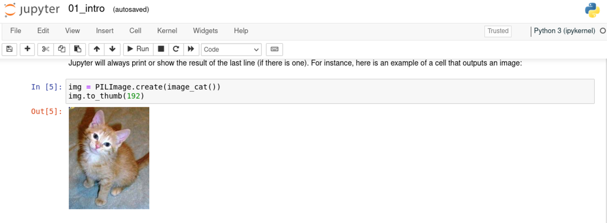

# Gentle Introduction to Apptainer
### by building a FAST.AI container image

[Apptainer](http://apptainer.org/) is a relatively new open-source container management system for building and running secure HPC solutions. It is formerly known as the Singularity project, which began as an open-source project in 2015 aiming to bring containers to HPC clusters and the scientific computing world.

I will assume you have some basic familiarity with container technology, such as Docker. But if you are an experienced Docker user, most of the concepts you can quickly and easily transfer to the Apptainer world.

There are multiple neat features that come with Apptainer software. Some of them are: portability, persistent overlay filesystems, container encryption, "rootless" execution, good support for GPUs and FPGAs, and support for OpenMPI and MPICH distributed computing.

I want to focus on another possible application of the Apptainer, which I found very convenient to use for it: machine learning model prototyping and experimentation.

When you are building or experimenting with multiple machine learning environments simultaneously or creating various versions of your machine learning models, sooner or later, you will encounter dependency hell.

Conda package manager or Docker containers can alleviate some of these prototyping challenges. However, Conda might not save you from OS-level package conflicts. Docker containers are not very convenient for iterative and interactive changes (rather for packaging final model artifacts). Also, Docker OverlayFS may add significant overhead to IO performance.

I found Apptainer very convenient when I need to quickly synchronize model (optionally with data) development environment between laptop and cloud instances, train model on a large distributed pool of compute nodes, or work in a "VM-like" isolated environment with machine learning models.

## Installing Apptainer

The following procedure has been derived from Apptainer documentation and tested on Ubuntu 20.04 and Ubuntu 22.04. You can also refer to this installation script for a complete list of steps.

```shell
$ lsb_release -a
Distributor ID:    Ubuntu
Description:    Ubuntu 20.04.3 LTS
Release:    20.04
Codename:    focal
```

Ensure repositories are up-to-date and dependencies are installed:

```shell
$ sudo apt-get install -y \
   build-essential \
   libseccomp-dev \
   pkg-config \
   squashfs-tools \
   cryptsetup \
   curl wget git

```

To compile and run Apptainer we need Go installed:
```shell
$ export VERSION=1.18.1 OS=linux ARCH=amd64 && wget https://dl.google.com/go/go$VERSION.$OS-$ARCH.tar.gz && sudo tar -C /usr/local -xzvf go$VERSION.$OS-$ARCH.tar.gz
$ echo 'export PATH=/usr/local/go/bin:$PATH' >> ~/.bashrc && source ~/.bashrc
$ go version
go version go1.18.1 linux/amd64
$ rm go$VERSION.$OS-$ARCH.tar.gz
```

Download and install Apptainer. At the time of writing, the latest version of Apptainer is 1.0.2, but we will proceed with 1.0.1:
```shell
$ export VERSION=1.0.1 &&  wget https://github.com/apptainer/apptainer/releases/download/v${VERSION}/apptainer-${VERSION}.tar.gz && tar -xzf apptainer-${VERSION}.tar.gz && cd apptainer-${VERSION}
```

If all goes well, you will be inside an Apptainer folder. Now let's compile Apptainer code:
```shell
$ ./mconfig && make -C builddir && sudo make -C builddir install
$ apptainer version
1.0.1
```
If all steps are completed successfully, you should have Apptainer installed and ready for use.

## Hello-World container
Apptainer is fully compatible with Docker images, and you can use virtually any Docker image as a base image to devise Apptainer containers.


Let us use Docker's official hello-world docker image to test our setup of Apptainer:

```shell
$ cd ~ && mkdir -p apptainer-images
$ apptainer pull docker://hello-world
$ ls -l
 hello-world_latest.sif
```

When you pull from the Docker hub, Apptainer will automatically convert an image to Apptainer format with SIF extension. This extension refers to The Singularity Image Format (SIF). This format provides the ability to build and package Apptainer containers in a single file, including headers, container definition, immutable runtime, and writable space.

We can inspect container SIF image contents by running inspect command:

```shell
$ apptainer inspect  hello-world_latest.sif

org.label-schema.build-arch: amd64
org.label-schema.build-date: Sunday_8_May_2022_12:23:16_EDT
org.label-schema.schema-version: 1.0
org.label-schema.usage.apptainer.version: 1.0.1
org.label-schema.usage.singularity.deffile.bootstrap: docker
org.label-schema.usage.singularity.deffile.from: hello-world
```

You can run our Apptainer version of Docker Hello-World container following way:

```shell
$ apptainer run  hello-world_latest.sif
Hello from Docker!
This message shows that your installation appears to be working correctly.
...
```


## Apptainer CLI Cheat Sheet

If you are familiar with Docker CLI, then you will recognize many of the commands. However, there are a few differences in terminology between Apptainer and Docker I want to highlight. You can check the full CLI reference documentation here: https://apptainer.org/docs/user/main/cli.html


| Apptainer | Docker | Description |
| --- | --- | --- |
| apptainer pull docker:// |  docker pull |  Pull docker image |
| apptainer run |  docker run |  Execute container |
| apptainer build |  docker build |  Build a new container |
| apptainer exec |  docker exec |  Run a command within container |
| apptainer shell |  docker run -it |  Enter into a shell within container |
| apptainer instance start |  docker run -d |  Run container as a service |
| apptainer instance stop |  docker stop |  Stop container |
| The Definition file (.def) |  Dockerfile |  Blueprint to build a container |

## Apptainer definition file

The definition file (DEF file) in Apptainer plays the same role as Dockerfile for Docker.

A typical Apptainer definition file has the following sections:

- Bootstrap  - allows you to specify a container base image and an agent to start building a container. You can even build a container from scratch.

- %setup  - in this section, you can specify commands to run on the host system outside of a container prior build process will start.

- %files  -  allows you to specify files to copy inside a container.
  
- %environment  -  you can define environment variables to be set during the runtime of your container.
  
- %post  -  this section allows you to run commands during container build time. For example, install packages or clone git repositories.
  
- %runscript  -  this is the script that gets executed when you run a container. For instance, when you issue an apptainer run command.
  
- %startscript  -  this is the script that gets executed when you start a container as a service: apptainer instance start.
  
- %test  -  you can execute commands at the very end of the build process. For example, to execute tests and verify that image has been built successfully.
  
- %labels  -  in this section, you can add metadata to your container, i.e., author of the image, version and etc.
  
- %help  -  text that will be displayed for a user when they execute an apptainer run-help command.


There are other sections that can be defined within an Apptainer definition file. For example, SCIF %app* sections. Scientific Filesystem (SCIF) is a standard to define metadata and layout for Scientific Filesystem. This layout facilitates reproducibility, discoverability, and testing in scientific applications. With respect to Apptainer, SCIF %app* sections will enable you to have multiple entry points inside your container. You can find more details about SCIF support in Apptainer in this documentation: https://apptainer.org/docs/user/main/definition_files.html#scif-apps

## Running Nvidia Docker containers with Apptainer

Because Apptainer natively supports GPUs, you can run any NVIDIA NGC images or use them as base images in an Apptainer definition file.

For instance, we can run a PyTorch NGC image following way:

```shell
$ apptainer pull nvidia-pytorch:22.04-py3.sif docker://nvcr.io/nvidia/pytorch:22.04-py3
```

To attach GPU resources to your container we use the -nv option:

```shell
$ apptainer run --nv --containall nvidia-pytorch:22.04-py3.sif

Note: by default Apptainer will mount host filesystems available. To prevent that and make container isolated use  --containall option.
```

We can enter inside a container and verify GPUs are avaliable:

```shell
Apptainer> python -c "import torch; print(f'PyTorch version: {torch.__version__}'); print(f'CUDA devices: {torch.cuda.device_count()}')"

PyTorch version: 1.12.0a0+bd13bc6
CUDA devices: 2
```

You can check a more detailed walkthrough about running Nvidia NGC containers on Singularity (now Apptainer) in this blog post: https://developer.nvidia.com/blog/how-to-run-ngc-deep-learning-containers-with-singularity/

## Building a container for the FAST.AI course with Apptainer

[Practical Deep Learning for Coders](https://course.fast.ai/) is a popular MOOC course along with the [FastBook](https://github.com/fastai/fastbook) ([Deep Learning for Coders with Fastai and Pytorch: AI Applications Without a Ph.D.](https://books.google.no/books?id=xd6LxgEACAAJ)) published by Jeremy Howard and Sylvain Gugger.

This course embraces an experimentation approach to learning Deep Learning. And as it often happens with experimentation  -  we mess up our environment. One way to alleviate it is to use an Apptainer container image to be able to easily roll back or maintain multiple versions of fast.ai packages.

In this example, we will build an Apptainer container image which will contain ready to use environment with everything pre-installed: OS libraries, fast.ai library, fastbook notebooks, and Jupyter.

**We build this image for training purposes only**; therefore, we omit hardening a container image, which certainly should be done for any production use. You can learn more about security capabilities in the Apptainer documentation.

Here is the complete definition file to build an Apptainer container to run fast.ai notebooks: https://github.com/tensoralex/apptainer-fastai-container/blob/main/fastai-selfcontainer.def

### Step by step instructions:

Clone the repository with scripts and Apptainer definition file:

```shell
$ git clone https://github.com/tensoralex/apptainer-fastai-container.git
$ cd apptainer-fastai-container
```

Build the container:

```shell
$ sudo apptainer build fastai-selfcontainer.sif fastai-selfcontainer.def && apptainer overlay create --size 16384 fastai-selfcontainer.sif
```

A few words about the parameters of the apptainer build command:

- fastai-selfcontainer.sif  -  is the name for the target container image. It will contain a full image + writable area of the container to store data. You can transfer this image file to any other host which has Apptainer installed and launch it quickly.

- fastai-selfcontainer.def  -  the name of the definition file of the container we are trying to build.
- size 16384  -  we will add 16Gb of writable space to the container image. That is enough to run all Jupyter notebooks for FastBook. 
  
**It may take several minutes to pull all the dependencies and build an image.**
  

After a build completes, you should see the following output:

```shell
...
Cloning into 'fastbook'...
remote: Enumerating objects: 2477, done.
remote: Total 2477 (delta 0), reused 0 (delta 0), pack-reused 2477
Receiving objects: 100% (2477/2477), 78.29 MiB | 59.78 MiB/s, done.
Resolving deltas: 100% (1566/1566), done.
INFO:    Adding help info
INFO:    Adding labels
INFO:    Adding environment to container
INFO:    Adding startscript
INFO:    Adding runscript
INFO:    Adding testscript
INFO:    Running testscript
Container base is Ubuntu as expected.
INFO:    Creating SIF file...
INFO:    Build complete: fastai-selfcontainer.sif
```

Now we can run our container as in daemon mode:

```shell
$ sudo apptainer instance start --nv --dns 8.8.8.8 --net --network bridge --network-args "portmap=7888:8888/tcp" --writable fastai-selfcontainer.sif fastai-selfcontainer-instance
WARNING: nv files may not be bound with --writable
INFO:    instance started successfully
```

A few words about the parameters we used:

- **apptainer instance start**  - run container in detached mode (as a service).

- **-nv**  - attach GPU devices to the container. If you don't have GPU skip this option.

- **-dns 8.8.8.8 -net -network bridge**  -  enable networking for the container and set DNS resolution sever for a container.

- **-network-args "portmap=7888:8888/tcp"**  -  Jupyter automatically launched  on port 8888 inside a container and we map container port back on the host as 7888.

- **writable fastai-selfcontainer.sif**  -  we specify the name of the container image (.sif file) and make it writable during runtime.

- **fastai-selfcontainer-instance**  -  you can assign any name for your running container.

You can verify that container is up and running:

```shell
$ sudo apptainer instance list
INSTANCE NAME                    PID        IP            IMAGE
fastai-selfcontainer-instance    3905447    10.22.0.29    fastai-selfcontainer.sif
```

To stop container instance you can run:

```shell
$ sudo apptainer instance stop fastai-selfcontainer-instance
INFO:    Stopping fastai-selfcontainer-instance instance of fastai-selfcontainer.sif (PID=3905447)
```

f you stopped it, go back and start it again as described in the previous step via apptainer instance start.

You can enter into a shell inside a container:

```shell
$ sudo apptainer shell instance://fastai-selfcontainer-instance
(base) [container] /root $
(base) [container] /root $ cd ~
(base) [container] ~ $ df -hP .
Filesystem      Size  Used Avail Use% Mounted on
overlay          16G   45M   15G   1% /
(base) [container] ~ $ ls
fastbook  miniconda
```

The fastbook folder is automatically cloned from https://github.com/fastai/fastbook during container build time. You can update it at any time since the container started as writable.

Now you can open a web browser to access Jupyter notebook that is running inside your container: http://localhost:7888

Now you should be able to run fastbook notebooks inside your container:



